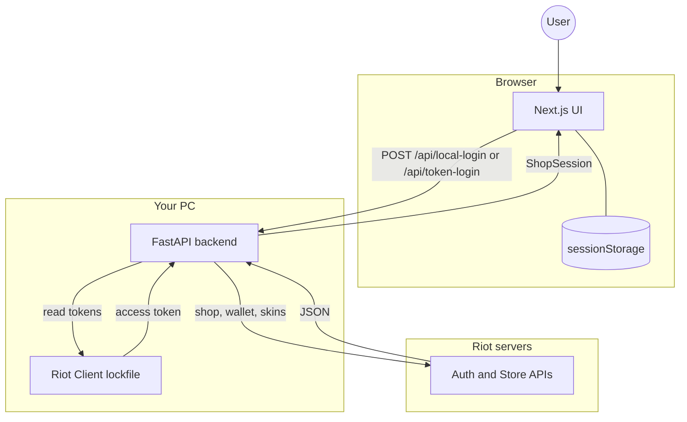

<div align="center">

**English** · [Русский](README.ru.md)

<br />

# Valorant Store

**View your Valorant daily shop and night market locally**

Next.js · FastAPI · Riot API

<br />

[](https://nextjs.org/)
[](https://fastapi.tiangolo.com/)
[](https://www.python.org/)
[](https://www.typescriptlang.org/)

<br />

[Quick start](#-quick-start) ·
[Features](#-features) ·
[Architecture](#-architecture) ·
[API](#-api) ·
[Security](#-security)

<br />

> ⚠️ **Disclaimer:** This project is not affiliated with Riot Games. Use at your own risk — third-party tools may violate Riot's terms of service.

</div>

---

## ✨ Features

| | |
|---|---|
| 🛒 **Daily shop** | Current daily skins with VP prices and refresh timer |
| 🌙 **Night market** | Discounts, percentages, and time left in the rotation |
| 💰 **VP balance** | Your current Valorant Points on the account |
| 🌍 **Regions** | EU, NA, AP, KR, LATAM, BR, or auto-detection |
| 🔐 **Two login methods** | Riot Client on your PC or browser access token |
| 🖥️ **Runs locally** | Everything on `127.0.0.1` — no cloud session storage |

---

## 🚀 Quick start

### Requirements

- **Node.js** 20+
- **Python** 3.11+
- **Riot Client** or Valorant running and logged in (for the main login flow)
- **macOS** or **Windows** (local login reads the Riot Client lockfile)

### 1 · Backend

```bash
cd backend
python3 -m venv venv
source venv/bin/activate        # Windows: venv\Scripts\activate
pip install -r requirements.txt
uvicorn main:app --reload --host 127.0.0.1 --port 8000
```

Health check: `curl http://127.0.0.1:8000/health` → `{"status":"ok"}`

### 2 · Frontend

```bash
cp .env.example .env.local
npm install
npm run dev
```

Open **[http://localhost:3000](http://localhost:3000)** and sign in via Riot Client.

---

## 🔑 Login methods

<table>
<tr>
<th align="left">Riot Client</th>
<th align="left">Browser token</th>
</tr>
<tr>
<td>

Recommended.

1. Launch Riot Client / Valorant
2. Select your region on the login page
3. Click **Sign in via Riot Client**

</td>
<td>

Fallback when the client is unavailable.

1. Open Riot login in the browser
2. Copy the redirect URL or `access_token`
3. Paste it on the login page

</td>
</tr>
</table>

---

## 🏗 Architecture

> Mermaid renders on GitHub. WebStorm and some editors show it as plain code — use the ASCII diagram below.



```
  User
   │
   ▼
┌────────────────────────────── Browser ──────────────────────────────┐
│  Next.js UI  ◄──── read/write ────►  sessionStorage (tab only)      │
└───────────────────────────────┬─────────────────────────────────────┘
                                │ HTTP REST
                                ▼
┌──────────────────────────── Your PC ────────────────────────────────┐
│  FastAPI backend  ◄── read lockfile ──  Riot Client (local)         │
└───────────────────────────────┬─────────────────────────────────────┘
                                │ HTTPS
                                ▼
┌──────────────────────────── Riot servers ───────────────────────────┐
│  Auth API · Store API · Wallet API · valorant-api.com               │
└─────────────────────────────────────────────────────────────────────┘
```

**Data flow:**

1. User opens the Next.js app and signs in via Riot Client or browser token
2. Backend reads local lockfile tokens or validates the pasted access token
3. Backend fetches shop, wallet, and skin metadata from Riot
4. Frontend saves the result in `sessionStorage` for the current tab only

---

## 📁 Project structure

```
.
├── app/
│   ├── login/          # Login page
│   ├── redirect/       # Riot redirect handler
│   └── page.tsx        # Main shop view
├── lib/
│   └── valorant.ts     # Types, sessionStorage, backend URL
├── backend/
│   ├── main.py         # FastAPI + Riot integration
│   └── requirements.txt
├── shop.html           # Standalone HTML prototype
└── .env.example        # Environment variable template
```

---

## 🔌 API

| Method | Endpoint | Description |
|:-------|:---------|:------------|
| `GET` | `/health` | Backend health check |
| `POST` | `/api/local-login` | Login via Riot Client lockfile |
| `POST` | `/api/token-login` | Login with browser access token |
| `POST` | `/api/login` | Username/password *(legacy)* |

---

## ⚙️ Environment variables

Copy `.env.example` → `.env.local` for the frontend.

| Variable | Default | Description |
|:---------|:--------|:------------|
| `NEXT_PUBLIC_BACKEND_URL` | `http://127.0.0.1:8000` | FastAPI backend URL |
| `VALORANT_DEBUG` | `0` | Set to `1` for verbose backend logs (local debugging only) |

---

## 🛡 Security

- Do not commit `.env` files, logs, or access tokens
- Sessions live in browser `sessionStorage` only — nothing is stored on the server
- Backend redacts sensitive data in logs by default
- Local login reads the Riot Client lockfile — keep the backend on `127.0.0.1`

---

## 📜 Scripts

```bash
npm run dev      # Next.js dev server
npm run build    # Production build
npm run start    # Run production frontend
npm run lint     # ESLint
```

---

<div align="center">

<br />

**Valorant Store** — check your shop without leaving the browser.

<br />

<sub>Made with Next.js & FastAPI · Not affiliated with Riot Games</sub>

<br />

[Русский](README.ru.md)

</div>
