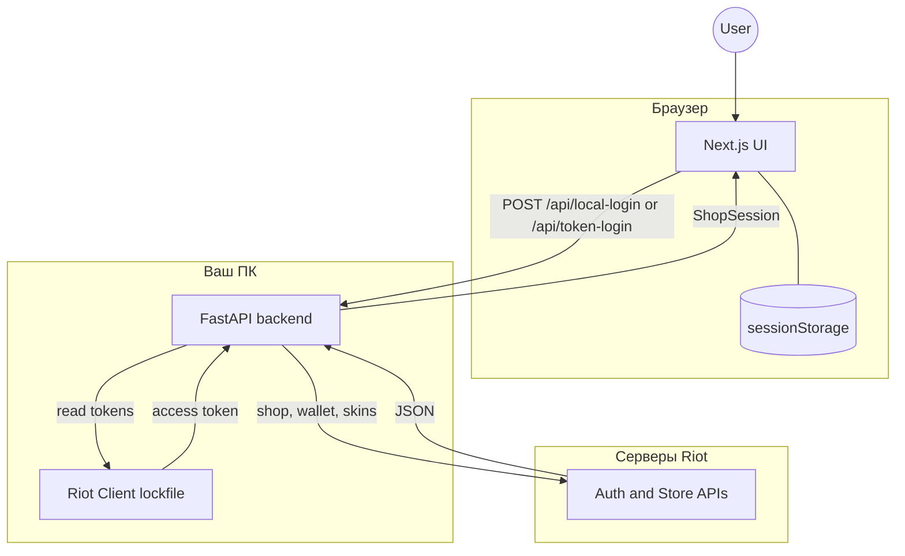

<div align="center">

[English](README.md) · **Русский**

<br />

# Valorant Store

**Локальный просмотр ежедневного магазина и ночного рынка Valorant**

Next.js · FastAPI · Riot API

<br />

[](https://nextjs.org/)
[](https://fastapi.tiangolo.com/)
[](https://www.python.org/)
[](https://www.typescriptlang.org/)
[](https://opensource.org/licenses/MIT)
[](https://www.gnu.org/licenses/gpl-3.0)

<br />

[Быстрый старт](#-быстрый-старт) ·
[Возможности](#-возможности) ·
[Архитектура](#-архитектура) ·
[API](#-api) ·
[Безопасность](#-безопасность)

<br />

> ⚠️ **Дисклеймер и правовая информация:**
> Этот проект является независимым и никак не связан с Riot Games.
> 
> **Valorant Store** isn’t endorsed by Riot Games and doesn’t reflect the views or opinions of Riot Games or anyone officially involved in producing or managing Valorant. Valorant and Riot Games are trademarks or registered trademarks of Riot Games, Inc. Valorant © Riot Games, Inc.
> 
> *Вы используете эту программу исключительно на свой страх и риск. Использование сторонних инструментов для взаимодействия с внутренними API может нарушать Условия использования (Terms of Service) Riot Games.*
</div>

---

## ✨ Возможности

| | |
|---|---|
| 🛒 **Ежедневный магазин** | Актуальные скины дня с ценами в VP и таймером обновления |
| 🌙 **Ночной рынок** | Скидки, проценты и оставшееся время до конца ротации |
| 💰 **Баланс VP** | Текущее количество Valorant Points на аккаунте |
| 🎨 **Темы** | Выбирай между Темной, Белой и Catppuccin (Mocha) стилистикой |
| 🌐 **Локализация** | Поддержка Английского, Украинского, Русского и Польского с флагами |
| 🔍 **Поиск скинов** | Кликни по скину, чтобы мгновенно найти его в Google |
| 🌍 **Регионы** | EU, NA, AP, KR, LATAM, BR или автоопределение |
| 🔐 **Два способа входа** | Через Riot Client на ПК или через browser token |
| 🖥️ **Локальный запуск** | Всё работает на `127.0.0.1`, без облачного хранения сессий |

---

## 🚀 Быстрый старт

### Требования

- **Node.js** 20+
- **Python** 3.11+
- **Riot Client** или Valorant, запущенные и авторизованные (для основного входа)
- **macOS** или **Windows** (локальный вход читает lockfile Riot Client)

### 1 · Backend

```bash
cd backend
python3 -m venv venv
source venv/bin/activate        # Windows: venv\Scripts\activate
pip install -r requirements.txt
uvicorn main:app --reload --host 127.0.0.1 --port 8000
```

Проверка: `curl http://127.0.0.1:8000/health` → `{"status":"ok"}`

### 2 · Frontend

```bash
cp .env.example .env.local
npm install
npm run dev
```

Откройте **[http://localhost:3000](http://localhost:3000)** и войдите через Riot Client.

---

## 🔑 Способы входа

<table>
<tr>
<th align="left">Riot Client</th>
<th align="left">Browser token</th>
</tr>
<tr>
<td>

Рекомендуемый способ.

1. Запустите Riot Client / Valorant
2. Выберите регион на странице входа
3. Нажмите **«Войти через Riot Client»**

</td>
<td>

Запасной вариант, если клиент недоступен.

1. Откройте Riot login в браузере
2. Скопируйте redirect URL или `access_token`
3. Вставьте на странице входа

</td>
</tr>
</table>

---

## 🏗 Архитектура

> Mermaid отображается на GitHub. WebStorm и часть редакторов показывают его как обычный код — ниже есть ASCII-схема.



```
  User
   │
   ▼
┌────────────────────────────── Browser ──────────────────────────────┐
│  Next.js UI  ◄──── read/write ────►  sessionStorage (только вкладка)│
└───────────────────────────────┬─────────────────────────────────────┘
                                │ HTTP REST
                                ▼
┌───────────────────────────── Ваш ПК ────────────────────────────────┐
│  FastAPI backend  ◄── lockfile ──  Riot Client (локально)           │
└───────────────────────────────┬─────────────────────────────────────┘
                                │ HTTPS
                                ▼
┌─────────────────────────── Серверы Riot ────────────────────────────┐
│  Auth API · Store API · Wallet API · valorant-api.com               │
└─────────────────────────────────────────────────────────────────────┘
```

**Поток данных:**

1. Пользователь открывает Next.js-приложение и входит через Riot Client или browser token
2. Backend читает локальный lockfile или проверяет вставленный access token
3. Backend запрашивает магазин, кошелёк и метаданные скинов у Riot
4. Frontend сохраняет результат только в `sessionStorage` текущей вкладки

---

## 📁 Структура проекта

```
.
├── app/
│   ├── context/        # Состояния локализации и тем
│   ├── login/          # Страница входа
│   ├── redirect/       # Обработка Riot redirect
│   └── page.tsx        # Главная — магазин
├── lib/
│   └── valorant.ts     # Типы, sessionStorage, backend URL
├── backend/
│   ├── main.py         # FastAPI + интеграция с Riot
│   └── requirements.txt
├── shop.html           # Standalone HTML-прототип
└── .env.example        # Шаблон переменных окружения
```

---

## 🔌 API

| Метод | Endpoint | Описание |
|:------|:-------|:---------|
| `GET` | `/health` | Проверка состояния backend |
| `POST` | `/api/local-login` | Вход через lockfile Riot Client |
| `POST` | `/api/token-login` | Вход по browser access token |
| `POST` | `/api/login` | Username/password *(legacy)* |

---

## ⚙️ Переменные окружения

Скопируйте `.env.example` → `.env.local` для frontend.

| Переменная | По умолчанию | Описание |
|:-----------|:-------------|:---------|
| `NEXT_PUBLIC_BACKEND_URL` | `http://127.0.0.1:8000` | URL FastAPI backend |
| `VALORANT_DEBUG` | `0` | `1` — подробные логи backend (только для локальной отладки) |

---

## 🛡 Безопасность

- Не коммитьте `.env`, логи и access token'ы
- Сессия хранится только в `sessionStorage` браузера — на сервере ничего не сохраняется
- Backend по умолчанию редактирует чувствительные данные в логах
- Локальный вход читает lockfile Riot Client — держите backend на `127.0.0.1`

---

## 📜 Скрипты

```bash
npm run dev      # Dev-сервер Next.js
npm run build    # Production-сборка
npm run start    # Запуск production frontend
npm run lint     # ESLint
```

---

<div align="center">

<br />

**Valorant Store** — смотри свой магазин, не выходя из браузера.

<br />

<sub>Made with Next.js & FastAPI · Not affiliated with Riot Games</sub>

<br />

## 📄 Лицензия

Этот проект распространяется под лицензией [MIT License](LICENSE) — подробности можно найти в файле.

[English](README.md)

</div>
